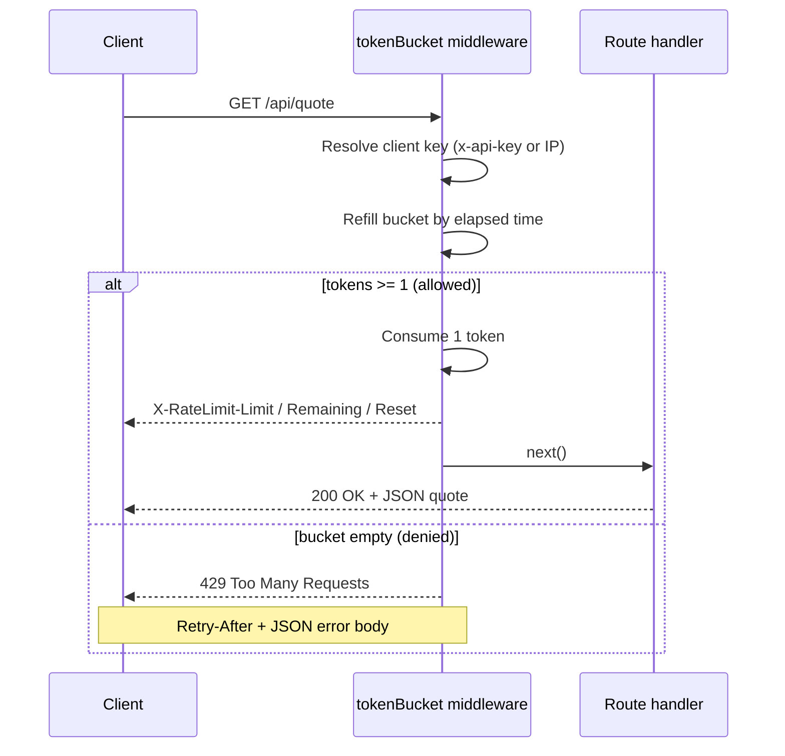

<!-- ══════════════════════════ TITLE ══════════════════════════ -->
<div align="center">
  
</div>

<br/>

<!-- ══════════════════════ IDIOMAS / LANGUAGES ══════════════════════ -->
<div align="center">
<a href="README.md"></a>
<a href="README.en.md"></a>
<a href="README.es.md"></a>
</div>

<br/>

[](https://github.com/geoggrigori/ratewise-api/actions/workflows/ci.yml)

[](https://www.typescriptlang.org/)
[](https://expressjs.com/)
[](https://vitest.dev/)
[](LICENSE)

A small, production-grade HTTP API that demonstrates a **token-bucket rate limiter**
implemented as reusable, strictly-typed Express middleware.

## Features

- **Token-bucket algorithm** — smooth bursts up to a configurable capacity with a
  steady refill rate, computed lazily so there are no background timers.
- **Reusable middleware** — drop `tokenBucket()` into any Express app.
- **Per-client buckets** — keyed by the `x-api-key` header when present, otherwise
  by client IP.
- **Standard headers** — `X-RateLimit-Limit`, `X-RateLimit-Remaining` and
  `X-RateLimit-Reset` on every response; `Retry-After` plus a structured JSON error
  on `429`.
- **Strict TypeScript** — `strict` mode with `noUncheckedIndexedAccess`.
- **Fully tested** — Vitest + supertest, including deterministic refill tests via an
  injectable clock.

## How it works



## Installation

```bash
git clone https://github.com/geoggrigori/ratewise-api.git
cd ratewise-api
npm install
```

## Usage

Run the server in watch mode for development:

```bash
npm run dev
```

Or build and run the compiled output:

```bash
npm run build
npm start
```

The server starts on `http://localhost:3000` by default.

### Example requests

A successful request to the rate-limited endpoint:

```bash
curl -i http://localhost:3000/api/quote
```

```http
HTTP/1.1 200 OK
X-RateLimit-Limit: 10
X-RateLimit-Remaining: 9
X-RateLimit-Reset: 1750000000
Content-Type: application/json

{
  "quote": {
    "text": "Make it work, make it right, make it fast.",
    "author": "Kent Beck"
  }
}
```

Send an API key to get your own bucket:

```bash
curl -i -H "x-api-key: my-secret-key" http://localhost:3000/api/quote
```

Once the bucket is empty you receive a `429`:

```http
HTTP/1.1 429 Too Many Requests
X-RateLimit-Limit: 10
X-RateLimit-Remaining: 0
X-RateLimit-Reset: 1750000001
Retry-After: 1
Content-Type: application/json

{
  "error": {
    "code": "rate_limit_exceeded",
    "message": "Too many requests. Please slow down and retry later.",
    "retryAfter": 1
  }
}
```

The health endpoint is never rate-limited:

```bash
curl -i http://localhost:3000/health
```

```json
{ "status": "ok" }
```

## Response headers

The middleware sets the following headers on every response:

| Header                  | Sent on    | Description                                                                                                   |
| ----------------------- | ---------- | ------------------------------------------------------------------------------------------------------------ |
| `X-RateLimit-Limit`     | all        | The bucket capacity (largest allowed burst).                                                                 |
| `X-RateLimit-Remaining` | all        | Whole tokens left after the current request.                                                                 |
| `X-RateLimit-Reset`     | all        | UNIX epoch in **seconds** when the bucket will next have at least one token. Equals "now" when one is already available. |
| `Retry-After`           | `429` only | Seconds the client should wait before retrying.                                                              |

## Configuration

All configuration is provided through environment variables (see `.env.example`):

| Variable        | Default | Description                                         |
| --------------- | ------- | --------------------------------------------------- |
| `PORT`          | `3000`  | Port the HTTP server listens on.                    |
| `RATE_CAPACITY` | `10`    | Maximum tokens per bucket (largest allowed burst).  |
| `RATE_REFILL`   | `1`     | Tokens refilled per second (sustained request rate).|

## Running tests

```bash
npm test
```

Run them in watch mode with `npm run test:watch`, or generate a coverage report with:

```bash
npm run test:coverage
```

Coverage uses the V8 provider and writes an HTML report to `coverage/`.

## License

[MIT](LICENSE) © 2026 Geovana Grigorio
