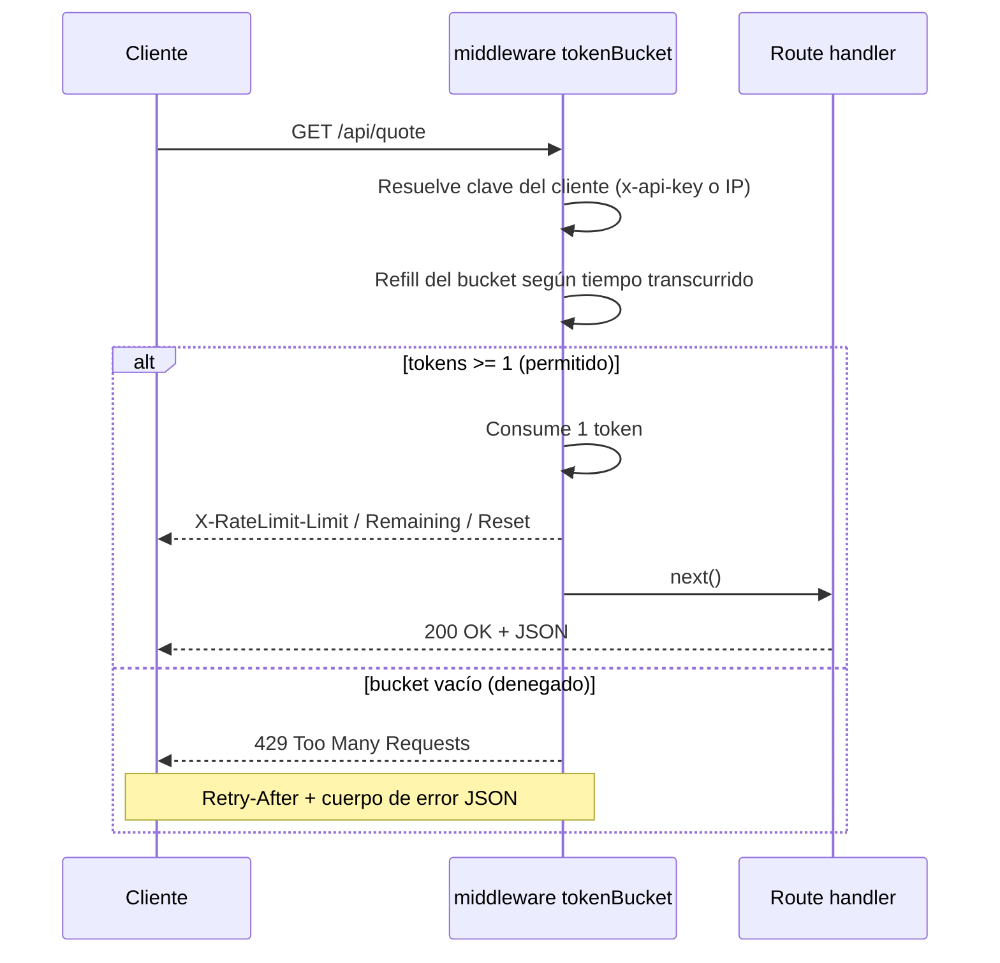

<!-- ══════════════════════════ PORTADA ══════════════════════════ -->
<div align="center">
  
</div>

<br/>

<!-- ══════════════════════ IDIOMAS / LANGUAGES ══════════════════════ -->
<div align="center">
<a href="README.md"></a>
<a href="README.en.md"></a>
<a href="README.es.md"></a>
</div>

<br/>

<h1 align="center">ratewise-api</h1>
<p align="center"><em>Middleware Express de rate limiting (token bucket), de nivel producción</em></p>
<p align="center"><strong>Bucket por cliente → refill lazy → headers estándar → 429 estructurado</strong></p>

<div align="center">
<a href="https://github.com/geoggrigori/ratewise-api/actions/workflows/ci.yml"></a>


</div>

<div align="center">
<a href="#acerca-de"></a>
<a href="#cómo-funciona"></a>
<a href="#uso"></a>
<a href="#configuración"></a>
</div>

<br/>

> ⚙️ **Sin timers en background.** El refill se calcula de forma perezosa (lazy) en cada petición.

## Acerca de

Una API HTTP pequeña, de nivel producción, que demuestra un **rate limiter token-bucket** implementado como middleware Express reutilizable y estrictamente tipado.

**Destacados:**
- **Algoritmo token-bucket** — suaviza ráfagas hasta una capacidad configurable, con tasa de refill constante.
- **Middleware reutilizable** — `tokenBucket()` conectable en cualquier app Express.
- **Buckets por cliente** — indexado por el header `x-api-key` cuando está presente, si no por IP.
- **Headers estándar** — `X-RateLimit-Limit`, `X-RateLimit-Remaining`, `X-RateLimit-Reset` en cada respuesta; `Retry-After` + error JSON estructurado en `429`.
- **TypeScript estricto** — modo `strict` con `noUncheckedIndexedAccess`.
- **Totalmente probado** — Vitest + supertest, con pruebas determinísticas de refill vía reloj inyectable.

## Cómo funciona



## Uso

```bash
git clone https://github.com/geoggrigori/ratewise-api.git
cd ratewise-api
npm install
npm run dev      # modo watch
```

**Ejemplo:**
```bash
curl -i http://localhost:3000/api/quote
```
```http
HTTP/1.1 200 OK
X-RateLimit-Limit: 10
X-RateLimit-Remaining: 9
X-RateLimit-Reset: 1750000000
```

Con el bucket vacío, devuelve `429` con `Retry-After` y cuerpo JSON estructurado. El endpoint `/health` nunca tiene rate limit.

## Configuración

| Variable | Predeterminado | Descripción |
|---|---|---|
| `PORT` | `3000` | Puerto del servidor HTTP |
| `RATE_CAPACITY` | `10` | Máximo de tokens por bucket (mayor ráfaga permitida) |
| `RATE_REFILL` | `1` | Tokens reabastecidos por segundo |

**Pruebas:**
```bash
npm test
npm run test:coverage   # reporte HTML en coverage/
```

## Licencia

[MIT](LICENSE).

<div align="center">
  
</div>

<p align="center"><sub>Desarrollado por <strong><a href="https://github.com/geoggrigori">Grigori</a></strong> · 2026</sub></p>
