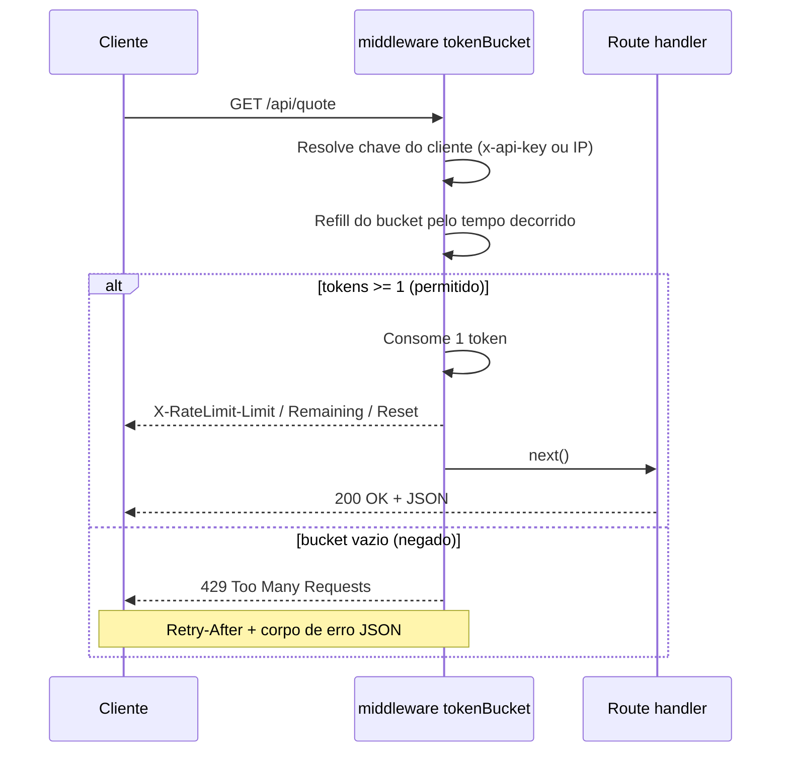

<!-- ══════════════════════════ TÍTULO ══════════════════════════ -->
<div align="center">
  
</div>

<br/>

<!-- ══════════════════════ IDIOMAS / LANGUAGES ══════════════════════ -->
<div align="center">
<a href="README.md"></a>
<a href="README.en.md"></a>
<a href="README.es.md"></a>
</div>

<br/>

<h1 align="center">ratewise-api</h1>
<p align="center"><em>Middleware Express de rate limiting (token bucket), com pegada de produção</em></p>
<p align="center"><strong>Bucket por cliente → refill lazy → headers padrão → 429 estruturado</strong></p>

<div align="center">
<a href="https://github.com/geoggrigori/ratewise-api/actions/workflows/ci.yml"></a>


</div>

<div align="center">
<a href="#sobre"></a>
<a href="#como-funciona"></a>
<a href="#uso"></a>
<a href="#configuração"></a>
</div>

<br/>

> ⚙️ **Sem timers em background.** O refill é calculado de forma preguiçosa (lazy) a cada requisição.

## Sobre

Uma API HTTP pequena, com pegada de produção, que demonstra um **rate limiter token-bucket** implementado como middleware Express reutilizável e estritamente tipado.

**Destaques:**
- **Algoritmo token-bucket** — suaviza rajadas até uma capacidade configurável, com taxa de refill constante.
- **Middleware reutilizável** — `tokenBucket()` plugável em qualquer app Express.
- **Buckets por cliente** — chaveado pelo header `x-api-key` quando presente, senão pelo IP.
- **Headers padrão** — `X-RateLimit-Limit`, `X-RateLimit-Remaining`, `X-RateLimit-Reset` em toda resposta; `Retry-After` + erro JSON estruturado no `429`.
- **TypeScript estrito** — modo `strict` com `noUncheckedIndexedAccess`.
- **Totalmente testado** — Vitest + supertest, com testes determinísticos de refill via clock injetável.

## Como Funciona



## Uso

```bash
git clone https://github.com/geoggrigori/ratewise-api.git
cd ratewise-api
npm install
npm run dev      # modo watch
```

**Exemplo:**
```bash
curl -i http://localhost:3000/api/quote
```
```http
HTTP/1.1 200 OK
X-RateLimit-Limit: 10
X-RateLimit-Remaining: 9
X-RateLimit-Reset: 1750000000
```

Com bucket vazio, retorna `429` com `Retry-After` e corpo JSON estruturado. O endpoint `/health` nunca é rate-limited.

## Configuração

| Variável | Padrão | Descrição |
|---|---|---|
| `PORT` | `3000` | Porta do servidor HTTP |
| `RATE_CAPACITY` | `10` | Máximo de tokens por bucket (maior rajada permitida) |
| `RATE_REFILL` | `1` | Tokens reabastecidos por segundo |

**Testes:**
```bash
npm test
npm run test:coverage   # relatório HTML em coverage/
```

## Licença

[MIT](LICENSE).

<div align="center">
  
</div>

<p align="center"><sub>Desenvolvido por <strong><a href="https://github.com/geoggrigori">Grigori</a></strong> · 2026</sub></p>
